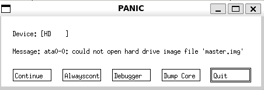

# 排查bochs中遇到的故障

## 1.boch不要直接sudo apt install bochs 大概率会出现问题，下载源码
- wget https://sourceforge.net/projects/bochs/files/bochs/2.7/bochs-2.7.tar.gz
- tar zxvf bochs-2.7.tar.gz
- cd bochs-2.7/
- ./configure --enable-debugger --enable-disasm --enable-iodebug --enable-x86-debugger --with-x --with-x11
- make -j
- sudo make install

## 2.注意bochsrc需要自动生成
- 执行boch
- 输入4
- 输入bochsrc
- 输入7
自动生成bochsrc后再根据需要修改，因为bochs对配置文件的要求很严格，不然你就会发现出现奇奇怪怪的报错

## 3.如果出现找不到相关的image
  
- 是因为与master.img同级目录下存在master.img.lock，直接rm master.img.lock即可

## 4.WSL2已经支持自带的gui，所以直接可以使用，不需要再安装如xfce4之类的工具

